# Procesverslag
Markdown is een simpele manier om HTML te schrijven.  
Markdown cheat cheet: [Hulp bij het schrijven van Markdown](https://github.com/adam-p/markdown-here/wiki/Markdown-Cheatsheet).

Nb. De standaardstructuur en de spartaanse opmaak van de README.md zijn helemaal prima. Het gaat om de inhoud van je procesverslag. Besteedt de tijd voor pracht en praal aan je website.

Nb. Door *open* toe te voegen aan een *details* element kun je deze standaard open zetten. Fijn om dat steeds voor de relevante stuk(ken) te doen.

## Jij

  
uitwerken voor kick-off werkgroep

  ### Auteur:
  Daniël Post

  #### Je startniveau:
  Blauw

  #### Je focus:
  Responsive
 

## Je website

  
uitwerken voor kick-off werkgroep

  ### Je opdracht:

  https://www.snickers.nl/
  

  #### Screenshot(s) van de eerste pagina (small screen): 
  Homepagina 
  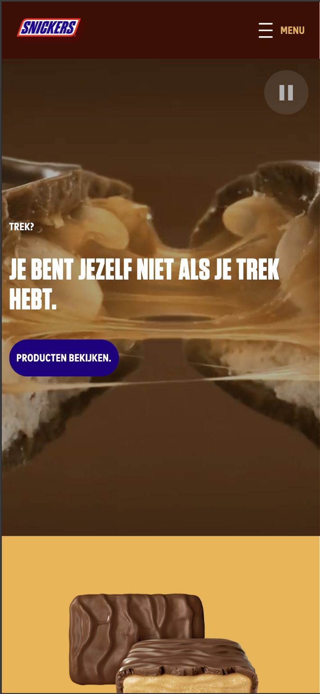

  #### Screenshot(s) van de tweede pagina (small screen):
  Ons verhaal pagina
  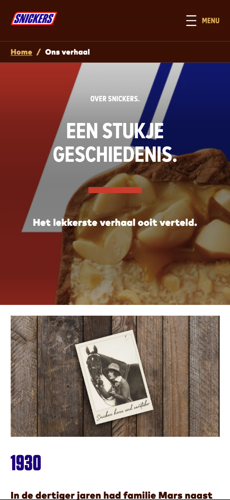
 

## Toegankelijkheidstest 1/2 (week 1)

  
uitwerken na test in 2e werkgroep

  ### Bevindingen
  Lijst met je bevindingen die in de test naar voren kwamen:

  Veel errors, verkeerd gebruik van h1, video kan niet op pauze, alleen als je tabt. Geen darkmode aanwezig.

  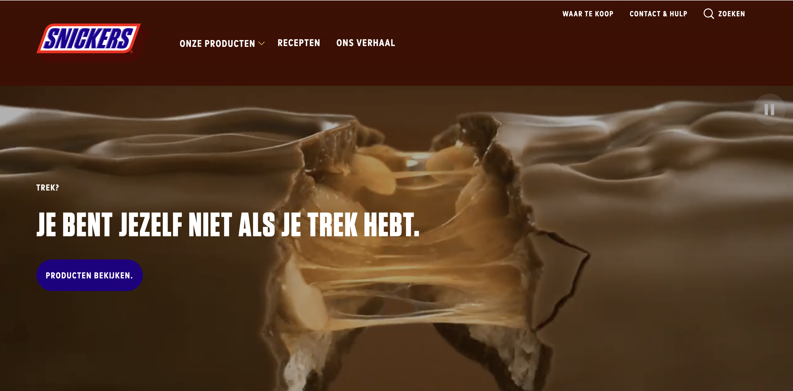

  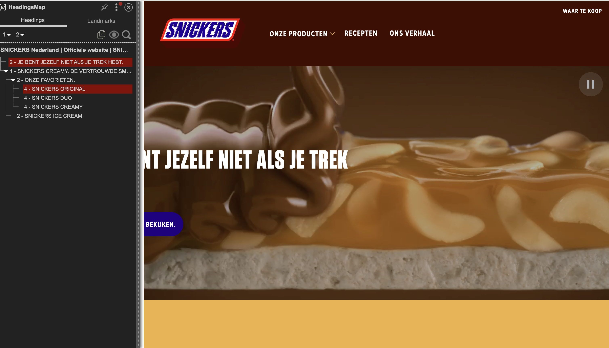

## Breakdownschets (week 1)

  
uitwerken na afloop 3e werkgroep

  ### de hele pagina: 
  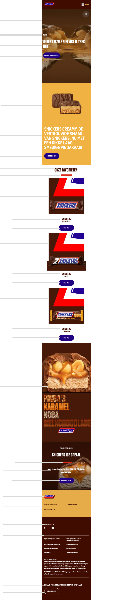

  ### dynamisch deel (bijv menu): 
  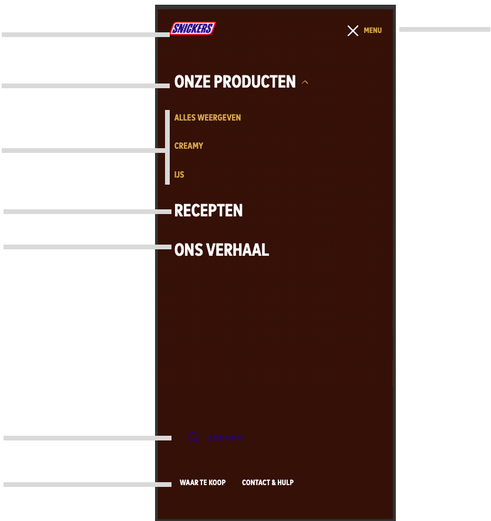

## Voortgang 1 (week 2)

  
uitwerken voor 1e voortgang

  ### Stand van zaken
  hier dit ging goed & dit was lastig (neem ook screenshots op van delen van je website en code)

  Nadat ik eindelijk een oplossing heb voor het plaatsen van de video, namelijk, het over filmen van de video, 
  kreeg ik deze niet goed in het scherm. 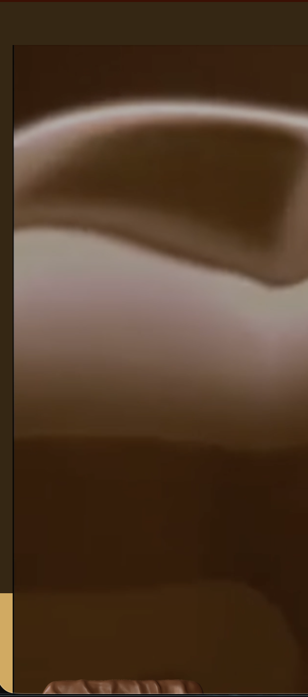

  Uiteindelijk heb ik het gedaan door object cover te gebruiken. en dat werkte goed 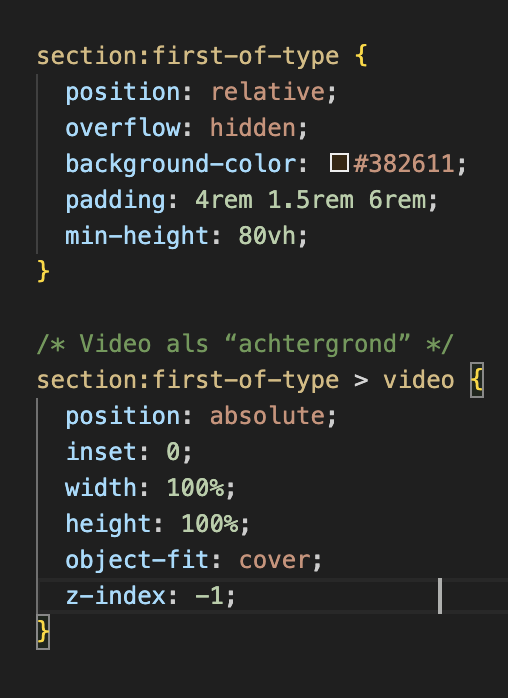

  ### Agenda voor meeting
  samen met je groepje opstellen

Daniel: Hoe moet ik de media query gebruiken, want dit is mij nog niet echt duidelijk. Waar werkt de media query voor?

Ronald: HTML nalopen

Tijn: HTML nalopen

Iz-dine: Vragen over ID bij labels 

  ### Verslag van meeting
  hier na afloop snel de uitkomsten van de meeting vastleggen

  - Daniel: Waar is media query voor? De media query is ervoor om de pagina repsonsive te maken, door dit te gebruiken kan je bij bepaalde "breakpoints" nieuwe stijling toevoegen.

  - Kennis punten: 

      Voor Javascript mogen wel ID's gebruikt worden
      Een figure is een foto met een caption eronder die informatie geeft over de foto
      Geen br's gebruiken in de html, dit is heel makkelijk in css te doen met een max-width
      position zou voor het hamburger menu een acceptabele manier zijn om te stylen
      Voor mobile first development begin met 320px scherm, als dat gelukt is ga dan verder naar ipad en desktop

## Voortgang 2 (week 3)

  
uitwerken voor 2e voortgang

  ### Stand van zaken
  hier dit ging goed & dit was lastig (neem ook screenshots op van delen van je website en code)

  Ik had heel veel moeite van het goed krijgen van mijn menu sluit icon voor het hamburger menu, hij was telkens heel groot, zie afbeelding. Uiteindelijk blijkt het dat de afbeelding gewoon groter is dan het hamburger icoon.

  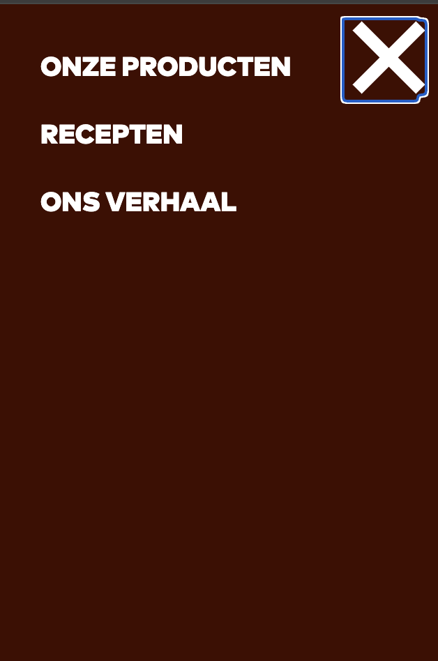

  ### Agenda voor meeting
  

Daniel: Waar gebruik ik custom properties voor? En hoe werkt het?

Ronald: Is mijn huidige gebruik van CSS goed of moet ik nog dingen aanpassen?
        Is het gebruik van commends zo duidelijk?
        Is de alt tekst van bepaalde afbeeldingen duidelijk genoeg?
        Voor sectie 4 had u mij flex aangeraden als manier van styling, de foto’s en achtergrond schalen mee hoe groter het scherm word. Dit is mij nog niet gelukt op te lossen omdat ik het niet snap. Zou u mij hierbij kunnen helpen?

Tijn: Vragen over grid structuur

Iz-dine: Of zijn code nog te redden valt. 

  ### Verslag van meeting

  - waarom gebruiken we custom propperties? 
    Custom properties worden gebruikt om dezelfde terugkerende elementen makkelijk te stijlen. Voor mijn website kan ik dit dus gebruiken voor de buttons, want die zijn overal hetzelfde. 

  - Bij een label waar een for in staat is het goed dat je een ID gebruikt(Het moet zelfs) In plaats van list style none gebruiken gebruik list-style-type:"" gebruik Flex basis voor de li gebruik flex grow voor het opvullen zet images op block om line eronder te verwijderen voor light dark mode zet daarboven color-scheme: "light-dark" zet in de root de font-family in de html,body tag voor grid is er ook iets genaamd max-content voor grid is eer ooks iets genaamd grid-template-areas in grid heb je ook column-gap je kunt ook nth-of-type(even) doen voor even elementen & is voor een bijzonderheid in de code Css in volgorde van html bovenaan generieke dingen en onderaan specifieke dingen Van groot naar klein in css efficiente css schrijven is niet het doel, het doel is om begrijpbare code te schrijven bij width kan fit-content gebruikt worden margin-inline mag worden gebruikt als een geen flex of grid gebruikt word ::after kan worden gebruikt voor mijn download latest knop, gebruik display: flex en gap voor ruimte ertussen bij ::after moet er content: "" zijn maar deze zou leeg mogen blijven ::after mag niet worden gebruikt worden voor mijn download latest button, hier moet echt een voor worden gebruikt

## Toegankelijkheidstest 2/2 (week 4)

  
uitwerken na test in 9e werkgroep

  ### Bevindingen
  Ik heb nog geen light/dark mode toegevoegd, dus dat moet nog.

  Ik heb een goede structuur van headings.

  De screenreader loopt door mijn website heen.

   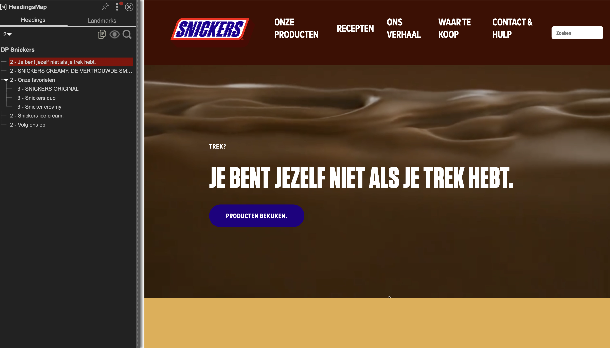
   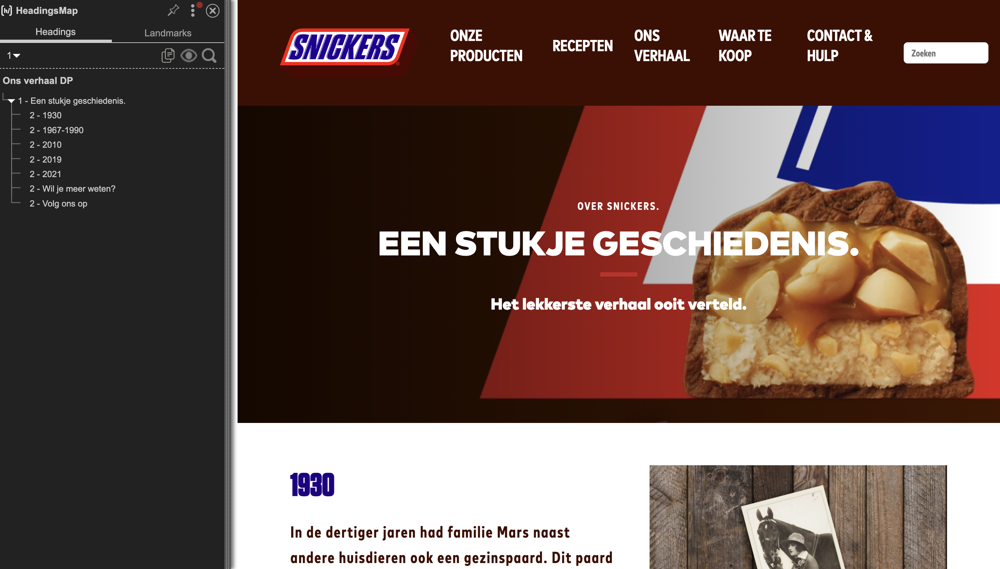

   

## Voortgang 3 (week 4)

  
uitwerken voor 3e voortgang

  ### Stand van zaken
  hier dit ging goed & dit was lastig (neem ook screenshots op van delen van je website en code)

  Ik loop een beetje achter. De tweede pagina moet ik nog mee beginnen, dit komt mede doordat ik alles in 1 css file had gestopt dus het was even heel wat werk om alles goed over te zetten naar de, zoals de opdracht voorschrijft, 3 lossen css files. Nog even gas geven om ervoor te zorgen dat mijn website sowieso af is voor het eind gesprek. Ook moet ik nog een light/dark mode toevoegen en dat snap ik nog niet zo goed dus daar mnoet ik ook even over gaan lezen.

  Ik heb deze week dus veel "opschoon" werk gedaan.

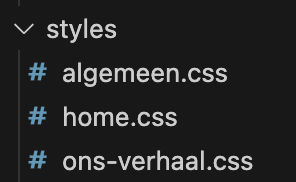

  ### Agenda voor meeting
  samen met je groepje opstellen

  Daniel: Hoe zorg ik ervoor dat mijn menu sluiten button inplaats van het hamburger icon komt?

  Ronald: Er zit padding aan de randen van de website na een schermgrootte van 1250px, hoe kan ik deze ook aanhouden responsive want ik gebruik nu een standaard rem

    Werkt mijn skiplink goed op deze manier, zo niet hoe kan ik deze kan verbeteren?

    Staan de links in mijn footer zo genoeg uit elkaar?

    Is de manier hoe ik mijn footer heb gemaakt goed?

    Voldoet mijn code aan de eisen?

  Iz-Dine: Is mijn code nog te redden of moet ik het opnieuw beginnen?

  Tijn: Voldoet mijn code aan de eisen?

    

  ### Verslag van meeting
  hier na afloop snel de uitkomsten van de meeting vastleggen

  - In javascript kan je de menu sluiten button laten tonen als er op het hamburger icoon wordt geklikt, het sluit icoon moet een grotere z-index hebben dan het hamburger icoon, zo komt deze boven het hamburger icoon.

  - De streepjes zijn makkelijk toe te voegen onder de h2 elementen

## Eindgesprek (week 5)

  
uitwerken voor eindgesprek

  ### Je uitkomst - karakteristiek screenshots:
  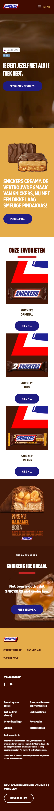

  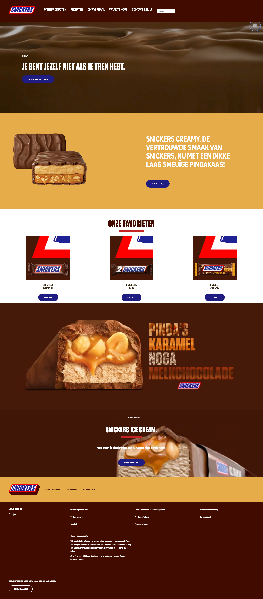

  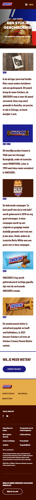

  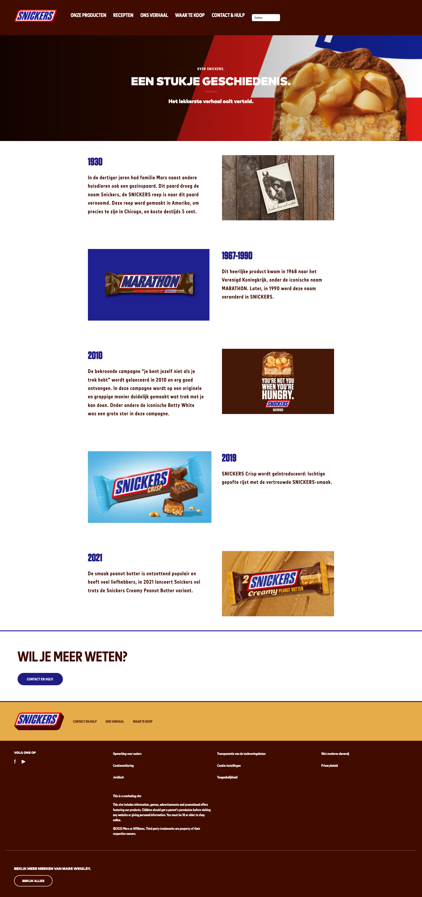

  ### Dit ging goed/Heb ik geleerd: 
  Korte omschrijving met plaatjes

  Ik heb geleerd hoe ik een video toevoeg, hoe ik een hamburger menu maak, hoe ik grid kan gebruiken om een pagina vorm te geven. Ook heb ik de basis geleerd van een light/dark mode functie en ben ik bezig geweest met de toegangkelijkheid van de website. 

  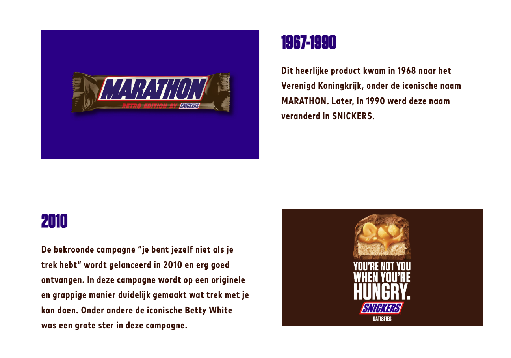

  ### Dit was lastig/Is niet gelukt:
  Ik vond het erg lastig om de structuur aan te passen van de volgorde van de items in de footer. Door te spelen met grid is het me uiteindelijk wel gelukt, maar het kostte me erg veel moeite. 

  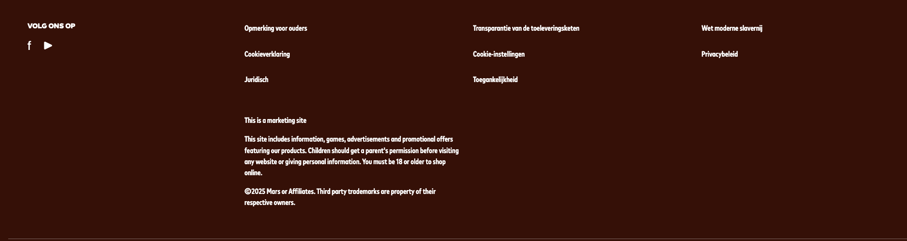

  Het is me niet gelukt om de search bar uit te lijnen met de list items in het navigatie menu in de header, tot mijn grote frustratie. Ik heb veel internet bronnen geraadpleegd, maar desondanks is het mij niet gelukt om deze items met elkaar uit te lijnen.

## Bronnenlijst

  
continu bijhouden terwijl je werkt

  1. MDN Web Docs – HTML <nav> element
    Gebruik voor uitleg waarom navigatie in <nav> hoort.

    MDN Web Docs. (z.d.). The Navigation Section element.
    https://developer.mozilla.org/en-US/docs/Web/HTML/Element/nav

  2. Bron: MDN Web Docs
      Search input en label gebruikt i.v.m. toegankelijkheid
      https://developer.mozilla.org/en-US/docs/Web/HTML/Element/input/search
   
  3. 
      Bron: MDN Web Docs – CSS Grid Layout
      CSS Grid gebruikt voor meerkoloms footer op desktop
      https://developer.mozilla.org/en-US/docs/Web/CSS/CSS_Grid_Layout

  4. 
      Bron: MDN Web Docs & Google Developers
      Mobile-first aanpak met min-width media queries
      https://developer.mozilla.org/en-US/docs/Web/CSS/Media_Queries
      https://developers.google.com/web/fundamentals/design-and-ux/responsive
      
  5. 
      Bron: MDN Web Docs
      Dark mode met prefers-color-scheme en CSS-variabelen
      https://developer.mozilla.org/en-US/docs/Web/CSS/@media/prefers-color-scheme  

  6. 
      Bron: MDN Web Docs
      Gebruik van position:absolute en object-fit voor video backgrounds
      https://developer.mozilla.org/en-US/docs/Web/CSS/object-fit

  7. 
    Bron: CSS-Tricks
    Flexbox gebruikt voor verticale uitlijning van hero-content
    https://css-tricks.com/snippets/css/a-guide-to-flexbox/

      

